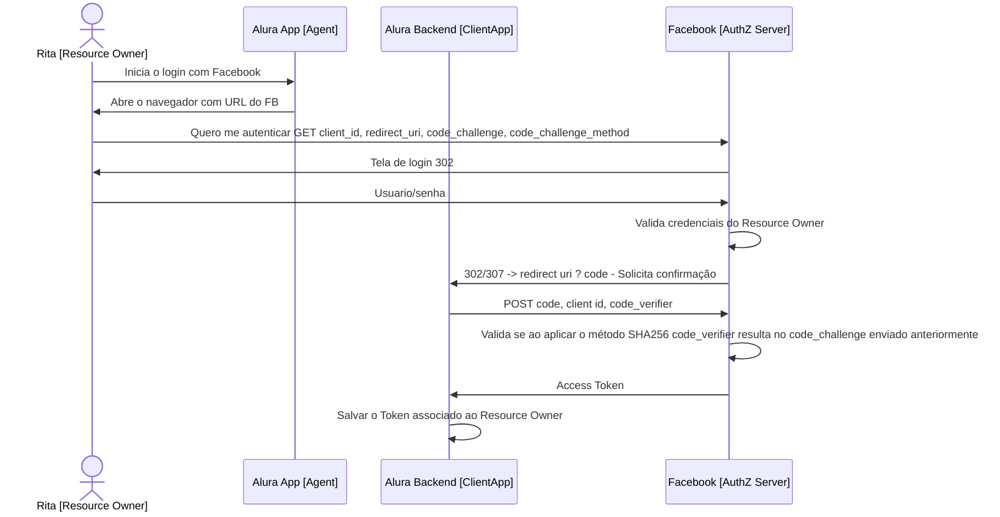
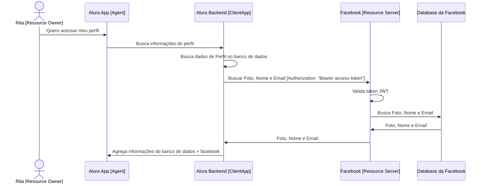

# Authorization Code Grant with PKCE (Proof of Key for Code Exchange)

Esse grant é uma extensão do grant **Authorization Code Grant** e ele pode ser usado quando temos **client applications**
públicos (aplicações que rodem do lado do cliente como é o caso de aplicativo móvel ou aplicações javascript que 
rodem diretamente pelo Browser)

O problema que essa extensão resolve é o fato de que o **client_secret** ficava em uma aplicação pública, 
como por exemplo no grant **Password Credentials** onde enviamos os dados sensíveis 
do usuário (username/password) e da aplicação (client_id/client_secret).

O fluxo se mantém quase o mesmo, a diferença é que não temos mais um **client_secret** e sim uma troca de códigos.

Na primeira parte do fluxo onde efetuavamos um _GET_ para o **authorization server** para obter o **authorization code** passando os dados:
 - client_id
 - redirect_url
 - scopes
 - response_type

Vamos enviar 2 novas informações: **code_challenge** e **code_challenge_method**.

O valor do **code_challenge_method** pode ser **plain** ou **S256**, 
e é altamente recomendado que seja utilizado a segunda opção.

Esse valor referece ao método que foi utilizado para gerar o valor do **code_challenge**. 
**S256** indica que foi utilizado um algorítimo de hash **SHA256**.

Na segunda parte do fluxo onde efetuamos um _POST_ para o **authorization server** 
para trocar o **authorization code** pelo **access token** passando os dados:
 - client_id
 - client_secret
 - code
 - scope
 - grant_type
 - redirect_uri

Não vamos mais enviar o **client_secret** e vamos enviar uma nova informação o **code_verifier**. 
Que é uma _string_ com no mínimo 43 caracteres e no máximo 128 caracteres.

Isso vai funcionar da seguinte forma:
 1. Antes de iniciar o fluxo de autorização, o **client application** vai gerar uma _string_ **randomica** com o comprimento entre 43 e 128 caracteres que vai ser o **code_verifier**.
 2. Após gerar essa _string_ o **client application** vai aplicar o algorítimo de hash **SHA256** e o resultado vai ser uma outra _string_ que vai ser o **code_challenge**.
 3. Com posse do **code_verifier** e do **code_challenge** a aplicação cliente inicia o fluxo de autenticação efetuando uma _request GET_ para o **authorization server** e passa como argumento o **code_challenge** e o método que foi utilizado para a geração do código.
 4. Após o usuário se autenticar a aplicação cliente recebe o **authorization code** que será utilizado para receber o **access token**
 5. Para trocar o **authorization code** pelo **access token** a aplicação cliente vai efetuar um _request POST_ para o **authorization server** passando o **authorization code** e o **code_verifier**.
 6. O **authorization server** vai validar se o **authorization code** está correto e vai aplicar o algorítimo de hash **SHA256** (que foi específicado no passo 3) no **code_verifier**. Se a _string_ de resultado for igual ao **code_challenge** informado no passo 3 o **authorization server** devolve o **access token**

[Documentação oficial](https://oauth.net/2/pkce/)

## Flows

## Obter o token

## Buscar/Enviar informações

