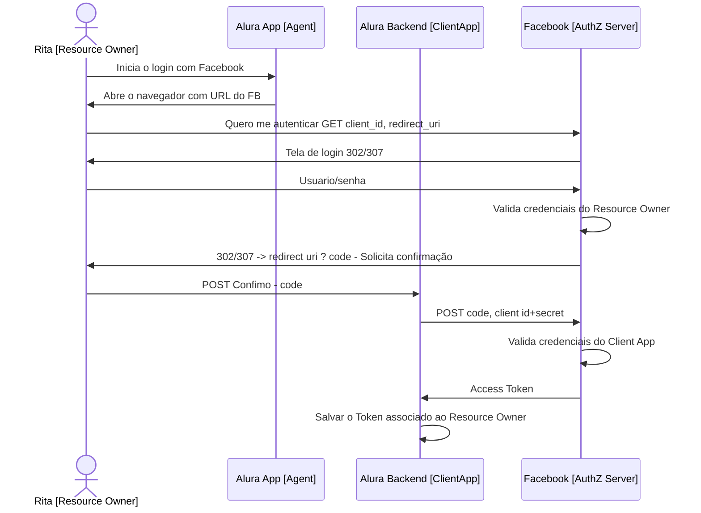
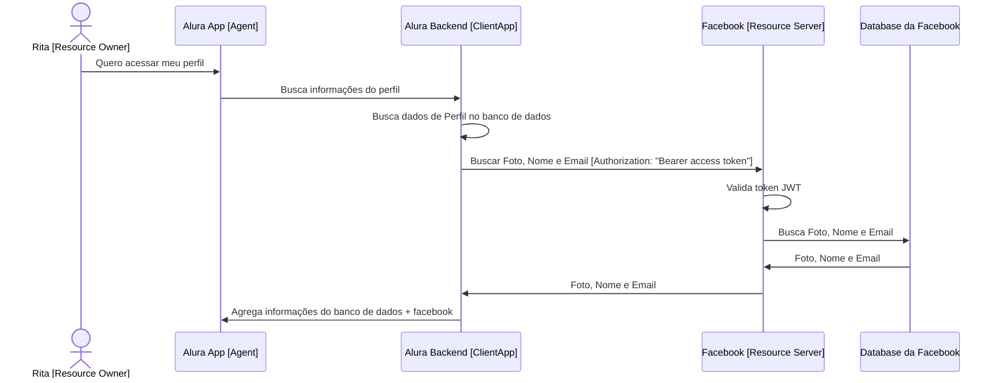

# Authorization Code Grant

Esse grant é usado em cenários onde o **resource owner** (usuário) 
quer utilizar um **agent** (aplicação cliente como applicativo mobile ou navegador) de __terceiros__ 
para acessar suas informações no **resource server** (servidor com as informações do usuário).

O **agent** vai se comunicar com o **client application** (seu próprio backend) e este   
vai requisitar as informações do **resource owner** ao **resource server**.

Nesse caso, não existe um alto grau de confiança entre o **client application** e o **resource server**.

[Documentação oficial](https://oauth.net/2/grant-types/authorization-code/)

## Flows

## Obter o token

## Buscar/Enviar informações

