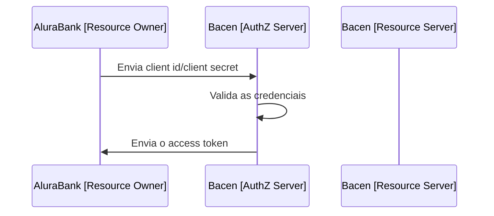
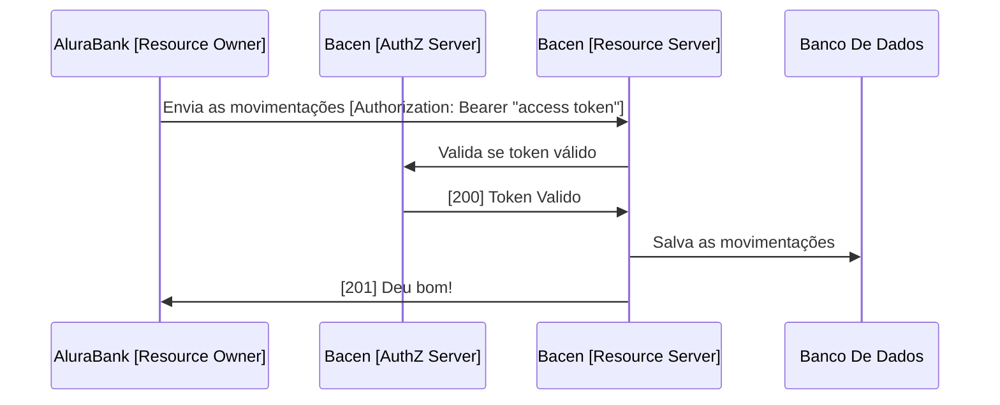
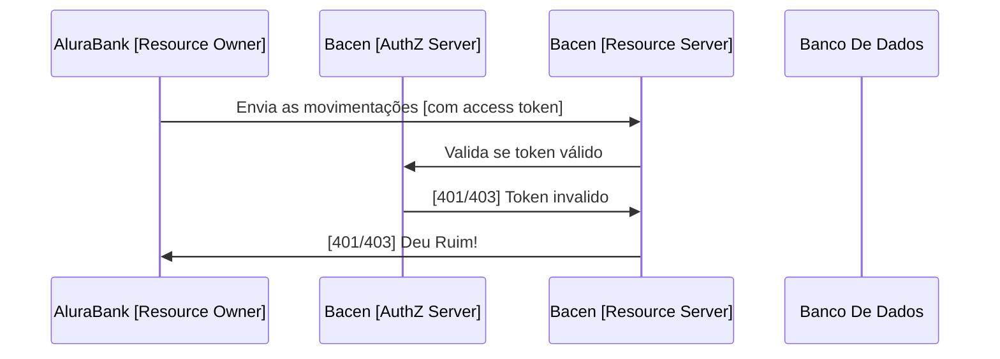

```mermaid
sequenceDiagram
    participant C   as AluraBank [Resource Owner]
    participant AS  as Bacen [AuthZ Server]
    participant RS  as Bacen [Resource Server]

    C->>AS: Envia client id/client secret
    AS->>AS: Valida as credenciais
    AS->>C: Envia o access token
```

```mermaid
sequenceDiagram
    participant C   as AluraBank [Resource Owner]
    participant AS  as Bacen [AuthZ Server]
    participant RS  as Bacen [Resource Server]
    participant DB  as Banco De Dados

    C->>RS: Envia as movimentações [Authorization: Bearer "access token"]
    RS->>AS: Valida se token válido
    AS->>RS: [200] Token Valido
    RS->>DB: Salva as movimentações
    RS->>C: [201] Deu bom!
```

```mermaid
sequenceDiagram
    participant C   as AluraBank [Resource Owner]
    participant AS  as Bacen [AuthZ Server]
    participant RS  as Bacen [Resource Server]
    participant DB  as Banco De Dados

    C->>RS: Envia as movimentações [com access token]
    RS->>AS: Valida se token válido
    AS->>RS: [401/403] Token invalido
    RS->>C: [401/403] Deu Ruim!
```
