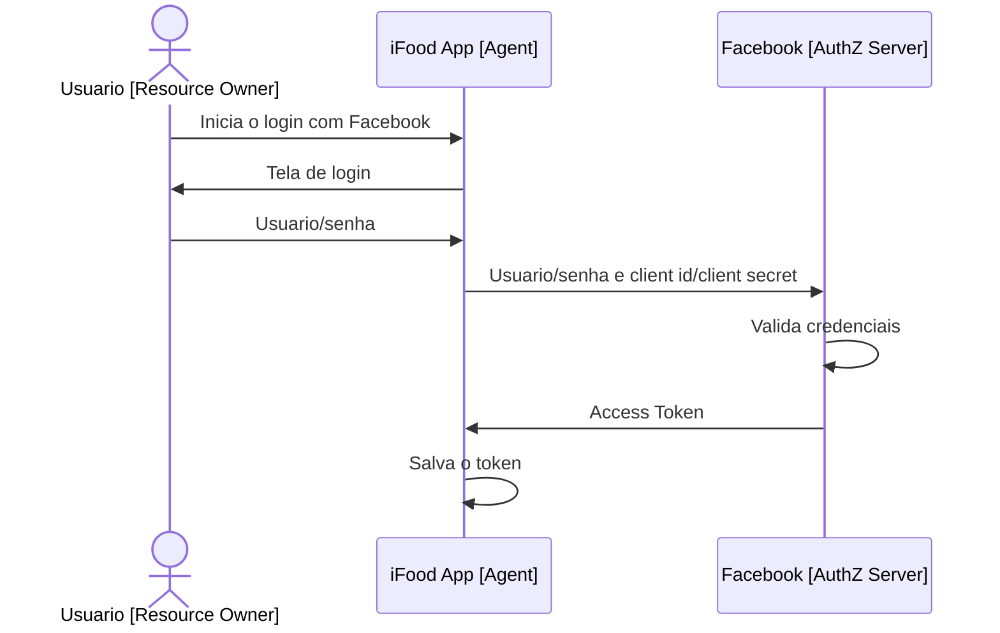
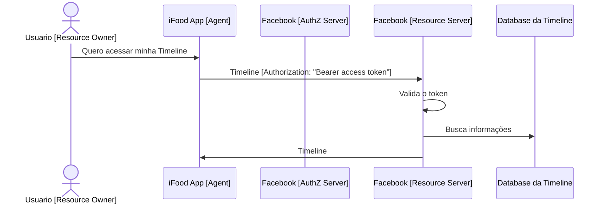

# Resource Owner Password Credentials Grant

Esse grant geralmente é usado em cenários onde o **resource owner** (usuário) quer utilizar um **agent** (aplicação cliente) 
para acessar seus dados no **resource server** (servidor com as informações do usuário).

Porém deve existir um alto grau de confiança entre o **agent** e o **authorization server**.

## Flows

## Obter o token

## Buscar/Enviar informações

